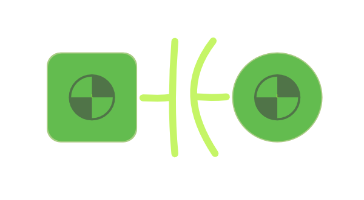
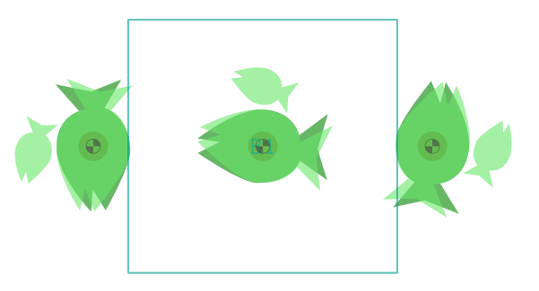

##########
Components
##########

Components are an essential part of every design. Here you'll find how to define a component, and how to place it on the board.

Defining components
===================

Components are defined in their own JSON file. The skeleton of this file is the following

.. code-block:: json

    {
      "pins":
      {
      },
      "layout":
      {
        "silkscreen":
        {
        },
        "assembly":
        {
        }
      },
      "pads":
      {
      }
    }

In ``pins`` the pins of the components are "declared" by instantiating one of the pads defined in ``pads``. In ``layout`` shapes for assembly and silkscreen are added.

pins
----

The ``pins`` block is where pins are instantiated. Here's what a 2-pin footprint would look like

.. code-block:: json

    {
      "pins":
      {
      "1":
        {	
          "layout": 
          {
            "pad": "pad", 
            "location": [-1.27, 0],
     	    "show-label": false
          }
        },
      "2-TH":
        {	
          "layout": 
          {
            "pad": "pad", 
            "location": [1.27, 0],
            "label": "PWR",
            "show-label": true
          }
        }
      }
    }

Each pin has a unique key -- ``1`` and ``2-TH`` above -- which do not necessarily need to be numbers. ``pad`` instantiates the type of landing pad to use, which is defined later. ``location`` is the position of the pin relative to the *centre of the component*.

*PCBmodE* can discreetly place a label at the centre of the pin (this is viewable when zooming in on the pin). The label can be defined using ``label``, or if ``label`` is missing, the key will be used instead. Labels will be shown by default, and ``"show-label": false`` will disable this functionality. 

pads
----

Pads define the shape of pins. Here's a definition for a simple throughole capacitor

.. code-block:: json

    {
      "pins": {
        "1": {  
          "layout": {
            "pad": "th-sq", 
            "location": [-2, 0]
          }
        },
        "2": {  
          "layout": 
          {
            "pad": "th", 
            "location": [2, 0]
          }
        }
      },
      "layout": {
        "silkscreen": {
          "shapes": [
            {
              "type": "path",
              "value": "m -10.515586,19.373448 c -0.214789,0.0199 -0.437288,0.01645 -0.664669,-0.0017 m -0.514055,0.01247 c -0.202682,0.02292 -0.412185,0.02382 -0.626017,0.01069 m 1.56129,1.209208 c -0.557685,-0.851271 -0.665205,-1.634778 -0.04126,-2.443953 m -0.82831,2.449655 c -0.07502,-0.789306 -0.06454,-1.60669 1.98e-4,-2.441891",
              "location": [0, 0],
              "style": "stroke"
            }
          ]
        },
        "assembly": {
          "shapes": [
            {
              "type": "rect",
              "width": 2.55,
              "height": 1.4
            }
          ]
        }
      },
      "pads": {
        "th": {
          "shapes": [
            {
              "type": "circle",
              "layers": ["top", "bottom"],
              "outline": 0,
              "diameter": 1.9,
              "offset": [0, 0] 
            }
          ],
          "drills": [
            {
              "diameter": 1
            }
          ]
        },
        "th-sq": {
          "shapes": [
            {
              "type": "rect",
              "layers": ["top", "bottom"],
              "width": 1.9,
              "height": 1.9,
              "offset": [0, 0],
              "radii": { "tl": 0.3,"bl": 0.3,"tr": 0.3,"br": 0.3 }
            }
          ],
          "drills": [
            {
              "diameter": 1
            }
          ]
        }
      }
    }

This would result in this component

Here's a more complex footprint for a battery holder on an ocean-themed board

.. code-block:: json

    {
      "pins": {
        "POS-1": {  
          "layout": 
          {
            "pad": "pad", 
            "location": [13.3, 0],
            "rotate": 95
          }
        },
        "NEG": {  
          "layout": {
            "pad": "pad", 
            "location": [0, 0]
          }
        },
        "POS-2": {  
          "layout": {
            "pad": "pad", 
            "location": [-13.3, 0],
            "rotate": -95
          }
        }
      },
      "layout": {
        "assembly": {
          "shapes": [
            {
              "type": "rect",
              "layers": ["top"],
              "width": 21.1,
              "height": 19.9,
              "offset": [0, 0] 
            }
          ]
        }
      },
      "pads": {
        "pad": {
          "shapes": [
          {
            "type": "path",
            "style": "fill",
            "scale": 1,
            "layers": ["top"],
            "value": "M 30.090397,29.705755 28.37226,29.424698 c 0,0 2.879054,-2.288897 4.991896,-2.270979 2.611383,0.02215 2.971834,2.016939 2.971834,2.016939 l 2.261927,-1.675577 -0.816738,2.741522 0.747218,2.459909 -2.119767,-1.518159 c 0,0 -0.605255,1.760889 -3.359198,1.739078 C 31.737346,32.90704 28.38105,30.56764 28.38105,30.56764 z",
            "soldermask": [
              {
                "type": "path",
                "style": "fill",
                "scale": 1,
                "rotate": 10,
                "layers": ["top"],
                "value": "M 30.090397,29.705755 28.37226,29.424698 c 0,0 2.879054,-2.288897 4.991896,-2.270979 2.611383,0.02215 2.971834,2.016939 2.971834,2.016939 l 2.261927,-1.675577 -0.816738,2.741522 0.747218,2.459909 -2.119767,-1.518159 c 0,0 -0.605255,1.760889 -3.359198,1.739078 C 31.737346,32.90704 28.38105,30.56764 28.38105,30.56764 z"
              },
              {
                "type": "path",
                "style": "fill",
                "scale": 0.5,
                "rotate": 20,
                "location": [0, 4.7],
                "layers": ["top"],
                "value": "M 30.090397,29.705755 28.37226,29.424698 c 0,0 2.879054,-2.288897 4.991896,-2.270979 2.611383,0.02215 2.971834,2.016939 2.971834,2.016939 l 2.261927,-1.675577 -0.816738,2.741522 0.747218,2.459909 -2.119767,-1.518159 c 0,0 -0.605255,1.760889 -3.359198,1.739078 C 31.737346,32.90704 28.38105,30.56764 28.38105,30.56764 z"
              }
            ]
          },
          {
            "type": "circle",
            "layers": ["bottom"],
            "outline": 0,
            "diameter": 2.3,
            "offset": [0, 0] 
          }
        ],
        "drills": [
          {
            "diameter": 1.2
          }
        ]      
        }
      }
    }

This will what it looks like

Notice that you can define multiple shapes for the soldermask that are independent of the shape of the shape of the copper.

To control how soldermask shapes are placed, you have the following options:

* No ``soldermask`` definition will assume default placement. The buffers and multipliers are defined in the board's JSON file
* ``"soldermask": []`` will not place a soldermask shape
* ``"soldermask": [{...},{...},...]`` as above will place custom shapes

Defining custom solderpaste shapes works in exactly the same way except that you'd use ``soldepaste`` instead of ``soldermask``.

layout shapes
-------------

Placing components
==================

.. code-block:: json

    {
      "locations":
      {
        "boards": "boards/",
        "components": "components/",
        "fonts": "fonts/",
        "build": "build/",
        "styles": "styles/"
      }
    }

.. code-block:: json

    {
      "J2": 
      {
        "footprint": "my-part", 
        "layer": "top", 
        "location": [
          36.7, 
          0
        ], 
        "rotate": -90, 
        "show": true, 
        "silkscreen": {
        "refdef": {
          "location": [
            -7.2, 
            2.16
          ], 
          "rotate": 0, 
          "rotate-with-component": false, 
          "show": true
        }, 
        "shapes": {
          "show": true
          }
        }
      }
    } 

