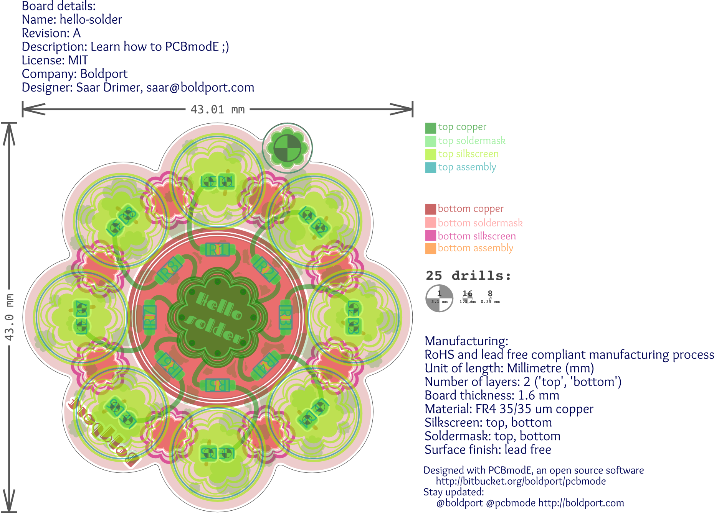

######################
Tutorial: hello-solder
######################

The 'hello-solder' is a fun design that could help beginners learn how to use *PCBmodE* by example.

Setup
=====

Outline
=======

Components
==========

Shapes
======

Routing
=======

Documentation and indexes
=========================

Production
==========
